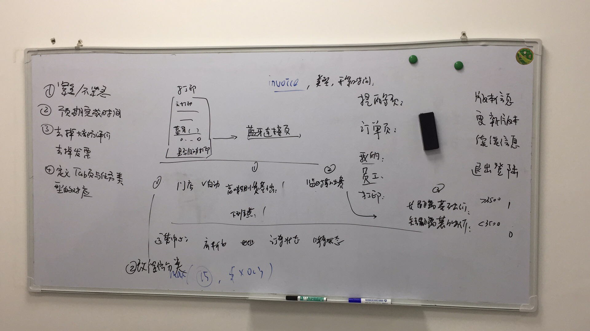

## 提醒页面逻辑

## 数据逻辑与交互

 - 紧急/不紧急： 在插入任务时确定。 具体请看每种任务类型的需求定义
 - 预期完成时间: 在插入时确定该任务预期完成的时间。 也可以不指定。 具体请看每种任务类型的定义。 
 
 去掉以下类型的数据：
 
 - 发票： 发票需要放下一个专门的地方处理
 - 非可疑差评的评价： 放在别的地方浏览就可以了
 
### Tab页面与任务类型的对应
 
  - 退单： 用户在外卖平台和微信发起的退款申请， 含部分退款
  - 催单： 
    - 外卖和微信/App发起的催单申请
    - 物流异常（例如严重延误，应发单未发单的订单）
  - 售后单
    - 可疑评价（有文字的、5星以下有关联订单的评价）
    - 客服人员建立的反馈： 这些反馈通常需要店员的进一步跟进。 如果需要立即跟进的，则是紧急单，如果可以稍后更近的，则
    认为是非紧急的工单。
  - 其他： 其他所有的任务都在这里，分为下面的几个子分类页面
    - 订单修改 【待实现】
    - 客服售后跟进（如回访） 【待实现】
    - 库存订货： 如缺货补货提醒、订货、盘货提醒 【需要将现在的提醒逻辑转入到提醒系统】
    - 任务： 手动建立的工单 【待实现】
    - 未归类： 所有以上之外的工单
    
    
    